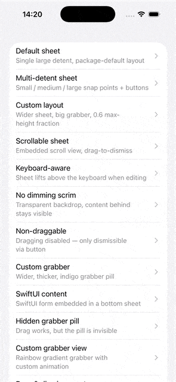

# BottomShelfer

A customizable slide-up bottom sheet presentation controller for UIKit. Works
pre-iOS 15, supporting arbitrary height detents, a draggable grabber, optional
dimming scrim, keyboard avoidance, rotation, and full layout-metric overrides.



## Requirements

- iOS 13.0+
- Swift 6.0+

## Installation

Swift Package Manager:

```swift
.package(url: "https://github.com/jonikay/BottomShelfer.git", from: "1.0.0")
```

## Quick start

```swift
import UIKit
import BottomShelfer

final class MySheetViewController: UIViewController, BottomShelferPresentable {
    let bottomShelferPresentationManager = BottomShelferPresentationManager()

    override func viewDidLoad() {
        super.viewDidLoad()
        view.backgroundColor = .systemBackground
    }
}

// Present it
let sheet = MySheetViewController()
sheet.bottomShelferPresentationManager.detents = [.medium(), .large()]
sheet.bottomShelferPresentationManager.selectedDetentIndex = 0
sheet.presentAsBottomShelfer(from: self, animated: true)
```

## Features

### Detents

Predefined or custom-height snap points. The sheet always settles on one.

```swift
manager.detents = [.small(), .medium(), .large()]           // screen‑ratio
manager.detents = [.custom(height: 320)]                     // exact points
manager.detents = BottomShelferDetent.detents(forContentHeight: 420)  // auto‑sized
manager.selectedDetentIndex = 1                              // start on medium
```

### Grabber pill

Visual drag affordance at the top of the sheet. Size, offset, and corner radius
are all configurable via `BottomShelferLayoutConfiguration`.

```swift
var layout = BottomShelferLayoutConfiguration()
layout.grabberPillSize = CGSize(width: 56, height: 6)
layout.grabberPillCornerRadius = 3
manager.layoutConfiguration = layout
```

The pill animates on drag — scales up slightly and fades — then returns to
identity when released. Disable the pill entirely by setting its size to `.zero`
while keeping the drag gesture active.

### Dimming scrim

Optional semi-transparent backdrop behind the sheet. Tap to dismiss (behavior
controlled by `dismissOnHide`).

```swift
manager.isDimmingViewEnabled = false             // no scrim
manager.dimmingColor = .black.withAlphaComponent(0.4)  // custom color
```

### Drag & scroll coordination

The sheet coordinates with embedded `UIScrollView`s — when the scroll view
is pinned to the top, a downward drag transfers control from the scroll view
to the sheet for dismiss / shrink.

```swift
manager.allowGrabbingNonScrollViews = true
```

Set `isDraggingEnabled = false` to disable dragging entirely (button‑dismiss
only).

### Keyboard avoidance

The sheet lifts out of the way when the keyboard appears.

```swift
var cancellables = Set<AnyCancellable>()
startObservingKeyboardForBottomShelfer(cancellables: &cancellables)
```

### Callbacks

Closures on `BottomShelferPresentationManager` fire during key lifecycle moments.

```swift
manager.onDismiss = { print("sheet dismissed") }
manager.onGrabberDragBegan = { print("grabber drag started") }
manager.onGrabberDragEnded = { print("grabber drag ended") }
manager.onContentDragBegan = { print("content drag started") }
manager.onContentDragEnded = { print("content drag ended") }
manager.onDetentChanged = { index, height in
    print("snapped to detent \(index) at \(height)pt")
}
```

### Programmatic snapping

Drive the sheet to any detent from code.

```swift
(presentationController as? BottomShelferPresentationController)?
    .snapToHeight(320)
```

### Rotation

The sheet re‑derives its detent when the container size changes (device rotation
or iPad multitasking). Frame clamping prevents off‑screen positions.

### Custom layout

Override the default metrics through `BottomShelferLayoutConfiguration`.

| Property | Default | Description |
|---|---|---|
| `maxSheetWidth` | 430 | Clamps sheet width on iPad |
| `maxHeightFraction` | 0.9 | Caps sheet height as fraction of container |
| `grabberHitAreaHeight` | 44 | Height of the draggable band |
| `grabberPillSize` | 36 × 5 | Pill dimensions |
| `grabberPillBottomOffset` | 12 | Distance from sheet edge |
| `grabberPillCornerRadius` | 2.5 | Pill corner radius |

Sheet corner radius and dimming color are set directly on the manager.

```swift
manager.cornerRadius = 24
manager.dimmingColor = .systemIndigo.withAlphaComponent(0.2)
```

### SwiftUI interop

Embed SwiftUI content inside a bottom sheet via `UIHostingController`.

```swift
let hosting = UIHostingController(rootView: MySwiftUIView())
addChild(hosting)
view.addSubview(hosting.view)
hosting.didMove(toParent: self)
```

## License

MIT — see [LICENSE](LICENSE).

## Author

**jonikay** — wdiltd399@gmail.com
